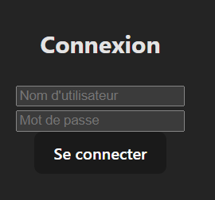
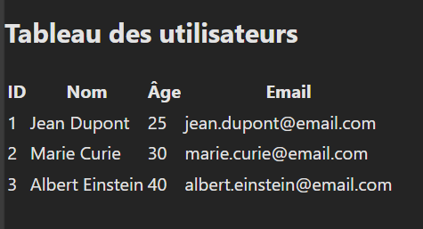

# Projet React : Tests automatisés avec Selenium + Pipeline CI/CD

Ce projet est une application React avec une configuration de **tests automatisés** utilisant **Selenium** et une intégration continue (CI) via **GitLab**.

---

## Objectifs du projet  
- Automatiser les tests fonctionnels avec **Selenium**  
- Intégrer le pipeline dans **GitLab CI/CD**  
- Analyser les performances après chaque build  
- Générer des rapports détaillés après l'exécution des tests  

---

## Technologies utilisées  
- **React (Vite)** → Framework JavaScript moderne  
- **Selenium** → Automatisation des tests sur navigateur  
- **GitLab CI/CD** → Déclenchement des tests après chaque commit  
- **React Router** → Gestion de la navigation  
- **CSS** → Styles personnalisés  

---

## Fonctionnalités  
- Page de connexion avec champ utilisateur et mot de passe  
- Vérification des identifiants :  
   - Nom d'utilisateur : `admin`  
   - Mot de passe : `password`  
- Redirection vers le tableau après connexion  
- Affichage d'un message d'erreur en cas de mauvais identifiants  
- Interface responsive avec style moderne  

---

## Captures d'écran  
**Page de connexion :**  
  

**Tableau des utilisateurs :**  
  

---

## Installation & Lancement  
1. **Clone le dépôt :**  
```bash
git clone https://github.com/ton-compte/test-automatisation-react.git
cd test-automatisation-react
npm install
npm run dev
